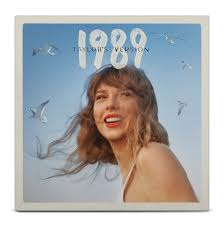

# *1989* and *1989 (Taylor’s Version)*  

*1989* marked Taylor Swift’s full transformation from country singer-songwriter to pop icon. Released in 2014, the album drew inspiration from the vibrant synth-pop of the 1980s, resulting in a polished and exuberant sound. It showcased her lyrical wit and emotional honesty through songs that balance vulnerability and confidence. The album won the Grammy Award for *Album of the Year* and solidified Swift’s position as one of the defining voices of her generation.  

*1989 (Taylor’s Version)*, released in 2023, reclaims one of her most beloved eras, offering re-recorded tracks with refined production and a nostalgic yet renewed energy. The five *From the Vault* tracks enrich the storytelling, capturing the essence of the *1989* era while revealing previously unheard dimensions of Taylor’s creativity.  

---

## Tracklists  

  

    

   
    <h3><em>1989 (2014)</em></h3>
 

    <ul>
        <li>Welcome to New York</li>
        <li>Blank Space</li>
        <li>Style</li>
        <li>Out of the Woods</li>
        <li>All You Had to Do Was Stay</li>
        <li>Shake It Off</li>
        <li>I Wish You Would</li>
        <li>Bad Blood</li>
        <li>Wildest Dreams</li>
        <li>How You Get the Girl</li>
        <li>This Love</li>
        <li>I Know Places</li>
        <li>Clean</li>
        <li>Wonderland</li>
        <li>You Are In Love</li>
        <li>New Romantics</li>
    </ul>

    <h3><em>1989 (2023)</em></h3>
 

    <ul>
        <li>Welcome to New York (Taylor’s Version)</li>
        <li>Blank Space (Taylor’s Version)</li>
        <li>Style (Taylor’s Version)</li>
        <li>Out of the Woods (Taylor’s Version)</li>
        <li>All You Had to Do Was Stay (Taylor’s Version)</li>
        <li>Shake It Off (Taylor’s Version)</li>
        <li>I Wish You Would (Taylor’s Version)</li>
        <li>Bad Blood (Taylor’s Version)</li>
        <li>Wildest Dreams (Taylor’s Version)</li>
        <li>How You Get the Girl (Taylor’s Version)</li>
        <li>This Love (Taylor’s Version)</li>
        <li>I Know Places (Taylor’s Version)</li>
        <li>Clean (Taylor’s Version)</li>
        <li>Wonderland (Taylor’s Version)</li>
        <li>You Are In Love (Taylor’s Version)</li>
        <li>New Romantics (Taylor’s Version)</li>
        <li>Slut! (Taylor’s Version) (From the Vault)</li>
        <li>Say Don't Go (Taylor’s Version) (From the Vault)</li>
        <li>Now That We Don't Talk (Taylor’s Version) (From the Vault)</li>
        <li>Suburban Legends (Taylor’s Version) (From the Vault)</li>
        <li>Is It Over Now(Taylor’s Version) (From the Vault)</li>
        <li>Bad Blood (Taylor’s Version) (From the Vault) (feat. Kendrick Lamar)</li>
    </ul>

