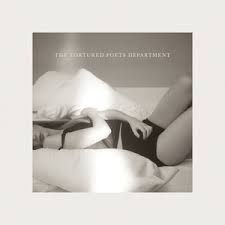

## The Tortured Poets Department — 2024

*The Tortured Poets Department* is a bold and introspective chapter in Taylor Swift’s discography — a double album steeped in literary allusions, irony, and emotional confession. Released in 2024, it captures the turmoil and catharsis of heartbreak, creative struggle, and reinvention. The record reads like a collection of poetic fragments — each song offering an intimate look into grief, desire, and the act of self-examination through art.

Blending synth-pop, piano ballads, and subtle electronic textures, Swift embraces melancholy and sharp self-awareness. Lyrically, the album plays with contradiction: cynicism and sincerity, myth and memory, vulnerability and strength. It feels like a late-night letter written in the aftermath of love, full of dry humour, self-reflection, and literary grace.

Working again with Jack Antonoff and Aaron Dessner, Swift crafts a sonic world that feels both haunted and hypnotic — an echoing confession booth for the modern poet. With *The Tortured Poets Department*, she turns heartbreak into literature, and self-reflection into a manifesto.

---

## Tracklists  

  

    

      
      <h3><em>The Tortured Poets Department (2024)</em></h3>
    

    <ul>
      <li>Fortnight (feat. Post Malone)</li>
      <li>The Tortured Poets Department</li>
      <li>My Boy Only Breaks His Favourite Toys</li>
      <li>Down Bad</li>
      <li>So Long, London</li>
      <li>But Daddy I Love Him</li>
      <li>Fresh Out the Slammer</li>
      <li>Florida!!! (feat. Florence + The Machine)</li>
      <li>Guilty as Sin?</li>
      <li>Who’s Afraid of Little Old Me?</li>
      <li>I Can Fix Him (No Really I Can)</li>
      <li>loml</li>
      <li>I Can Do It With a Broken Heart</li>
      <li>The Smallest Man Who Ever Lived</li>
      <li>The Alchemy</li>
      <li>Clara Bow</li>
    </ul>
  

  

    

      
      <h3><em>The Tortured Poets Department: The Anthology (2024)</em></h3>
    

    <ul>
      <li>The Black Dog</li>
      <li>imgonnagetyouback</li>
      <li>The Albatross</li>
      <li>Chloe or Sam or Sophia or Marcus</li>
      <li>How Did It End?</li>
      <li>So High School</li>
      <li>I Hate It Here</li>
      <li>thanK you aIMee</li>
      <li>I Look in People’s Windows</li>
      <li>The Prophecy</li>
      <li>Cassandra</li>
      <li>Peter</li>
      <li>The Bolter</li>
      <li>Robin</li>
      <li>The Manuscript</li>
    </ul>
  

---

### *The Anthology Commentary*

*The Tortured Poets Department: The Anthology* serves as an extended reflection on the original record — a continuation of the same emotional and poetic universe.  
These fifteen additional songs deepen the narrative, illuminating the quieter corners of heartbreak, irony, and survival.  
Where *The Tortured Poets Department* is sharp and self-aware, *The Anthology* feels quieter, more contemplative — an afterword written in candlelight.  
Together, they complete Swift’s most literary and self-referential work to date.

---

