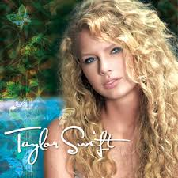
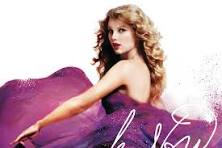
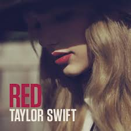
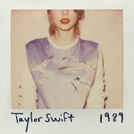
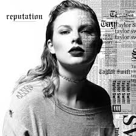
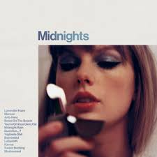
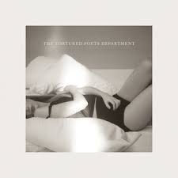
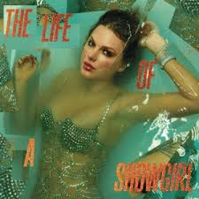

# Taylor Swift

 

---

## Early Life
Taylor Alison Swift was born on 13 December 1989 in Reading, Pennsylvania. She grew up on a Christmas tree farm, where she developed a deep love for storytelling and music. By the age of eleven, she was performing locally and writing her own songs. After convincing her parents to move to Nashville, Tennessee, she began pursuing her dream of becoming a country artist — a dream that would soon blossom into one of the most successful music careers of all time.

---

## Musical Career
Taylor Swift’s artistry is defined by transformation. Her self-titled debut introduced her as a young country songwriter; *Fearless* made her a household name; *Speak Now* confirmed her as one of the best lyricists of her generation. *Red* blended country with pop and emotional complexity, while *1989* completed her metamorphosis into a global pop icon. With *Reputation*, she reclaimed her narrative through darker, bolder sounds, before softening into *Lover* — a pastel celebration of love and growth.  
Her surprise releases, *Folklore* and *Evermore*, marked a return to storytelling roots with indie-folk influences, and *Midnights* offered a nocturnal reflection on fame and vulnerability. Most recently, *The Tortured Poets Department* showcased her as both poet and performer, fusing literary depth with modern production.  

Each era represents both a sonic and emotional evolution — Taylor Swift continues to reinvent herself while remaining unapologetically authentic.

 

---

## Explore the Eras
💚💛💜❤️🩵🖤🩷🩶🤎💙🤍❤️‍🔥

)

---

## ✍️ Songwriting and Artistry
Taylor Swift is celebrated for her eloquence and vulnerability. Every lyric she writes transforms personal experience into a universal story — heartbreak, friendship, ambition, and rebirth. She often plays with literary and cinematic imagery, from *The Last Great American Dynasty* to *The Archer*. Her collaborators, including Jack Antonoff and Aaron Dessner, have helped her shape entire musical landscapes, but her lyrical craftsmanship remains the core of her identity.  
Her songs aren’t just melodies — they’re emotional narratives that capture the intricacies of human experience.

---

## 💫 Philanthropy and Cultural Impact
Beyond her artistry, Swift has become a champion for artists’ rights, equality, and education. Her decision to re-record her earlier albums under *Taylor’s Version* has redefined ownership in the music industry. She’s donated millions to disaster relief, literacy programmes, and LGBTQ+ advocacy, while empowering fans worldwide to embrace their individuality. Taylor Swift isn’t just a performer — she’s a movement, constantly evolving yet always true to herself.

---

## 🐱 Taylor’s Beloved Cats

 

Taylor’s cats — Meredith Grey, Olivia Benson, and Benjamin Button — are beloved companions and symbols of her softer, homely side. Named after iconic characters from *Grey’s Anatomy*, *Law & Order: SVU*, and *The Curious Case of Benjamin Button*, they often appear in her social media posts and even her music videos. They represent comfort, independence, and the quiet joy that grounds her extraordinary life.

---
