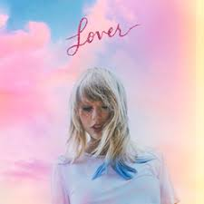

# Taylor Swift

#  

---

## Early Life

Taylor Alison Swift was born on 13 December 1989 in Reading, Pennsylvania, and spent most of her childhood in a small, quiet town called Wyomissing. Believe it or not, she actually grew up on a Christmas tree farm! That detail feels like something straight out of a Taylor Swift song — cosy, a bit magical, and full of heart. Her parents, Andrea and Scott Swift, were always very supportive of her. Andrea had a marketing background, and Scott worked as a stockbroker, but they never tried to push her in a “traditional” direction. Instead, they noticed her passion for music early on and gave her the space to explore it. Taylor also has a younger brother, Austin, and they shared a close bond while growing up surrounded by nature and family warmth.

From a young age, Taylor loved storytelling. She was that kid who always wrote poems, short stories, and little pieces of writing that later turned into songs. Her grandmother had been an opera singer, which definitely inspired her love for performing, even though Taylor’s style leaned more towards country and pop. During her school years at Wyomissing Area Junior/Senior High, she joined theatre shows and sang at local events. When she was just eleven, she sang the American national anthem at a basketball game — quite impressive for someone her age! Around the same time, a computer repairman who came to fix her parents’ computer showed her how to play a few chords on the guitar. That moment completely changed her life. She became obsessed with practising and soon started writing her own songs about her life and feelings.

Taylor’s dream was to make it in country music, so when she was eleven, she and her mum took a trip to Nashville with a demo CD, hoping someone would notice her talent. But, as many successful artists will tell you, the start is never easy — every record label turned her down. Still, she didn’t give up. Her determination was something special. In fact, her family believed in her so much that when she was fourteen, they moved to Hendersonville, Tennessee, just to be closer to Nashville. That’s where Taylor really started shaping her career — writing songs, performing locally, and working on her craft day after day.

Looking back, what’s so inspiring about Taylor’s early life is how focused she was on her dream even when things didn’t go her way. She wasn’t an overnight success; she worked incredibly hard, and her story proves that talent mixed with persistence can really change everything. Growing up on that Christmas tree farm, surrounded by love, creativity, and encouragement, gave her the roots she needed to bloom into the artist we know today.

---

## Musical Career
Taylor Swift’s artistry is defined by transformation. Her self-titled debut introduced her as a young country songwriter; *Fearless* made her a household name; *Speak Now* confirmed her as one of the best lyricists of her generation. *Red* blended country with pop and emotional complexity, while *1989* completed her metamorphosis into a global pop icon. With *Reputation*, she reclaimed her narrative through darker, bolder sounds, before softening into *Lover* — a pastel celebration of love and growth.  
Her surprise releases, *Folklore* and *Evermore*, marked a return to storytelling roots with indie-folk influences, and *Midnights* offered a nocturnal reflection on fame and vulnerability. Most recently, *The Tortured Poets Department* showcased her as both poet and performer, fusing literary depth with modern production.  

Each era represents both a sonic and emotional evolution — Taylor Swift continues to reinvent herself while remaining unapologetically authentic.

 

---

## Explore the Eras
### 💚💛💜❤️🩵🖤🩷🩶🤎💙🤍❤️‍🔥

### [💚](album/taylor_swift_(debut))[💛](album/taylor_swift_fearless)[💜](album/taylor_swift_speak_now)[❤️](album/taylor_swift_red)[🩵](album/taylor_swift_1989)[🖤](album/taylor_swift_reputation)[🩷](album/taylor_swift_lover)[🩶](album/taylor_swift_lover)[🤎](album/taylor_swift_evermore)[💙](album/taylor_swift_midnights)[🤍](album/taylor_swift_the_tortured_poets_department)[❤️‍🔥](album/taylor_swift_the_life_of_a_showgirl)

)

---

## ✍️ Songwriting and Artistry
Taylor Swift is celebrated for her eloquence and vulnerability. Every lyric she writes transforms personal experience into a universal story — heartbreak, friendship, ambition, and rebirth. She often plays with literary and cinematic imagery, from *The Last Great American Dynasty* to *The Archer*. Her collaborators, including Jack Antonoff and Aaron Dessner, have helped her shape entire musical landscapes, but her lyrical craftsmanship remains the core of her identity.  
Her songs aren’t just melodies — they’re emotional narratives that capture the intricacies of human experience.

---

## 💫 Philanthropy and Cultural Impact
Beyond her artistry, Swift has become a champion for artists’ rights, equality, and education. Her decision to re-record her earlier albums under *Taylor’s Version* has redefined ownership in the music industry. She’s donated millions to disaster relief, literacy programmes, and LGBTQ+ advocacy, while empowering fans worldwide to embrace their individuality. Taylor Swift isn’t just a performer — she’s a movement, constantly evolving yet always true to herself.

---

## 🐱 Taylor’s Beloved Cats

 

Taylor’s cats — Meredith Grey, Olivia Benson, and Benjamin Button — are beloved companions and symbols of her softer, homely side. Named after iconic characters from *Grey’s Anatomy*, *Law & Order: SVU*, and *The Curious Case of Benjamin Button*, they often appear in her social media posts and even her music videos. They represent comfort, independence, and the quiet joy that grounds her extraordinary life.

---
